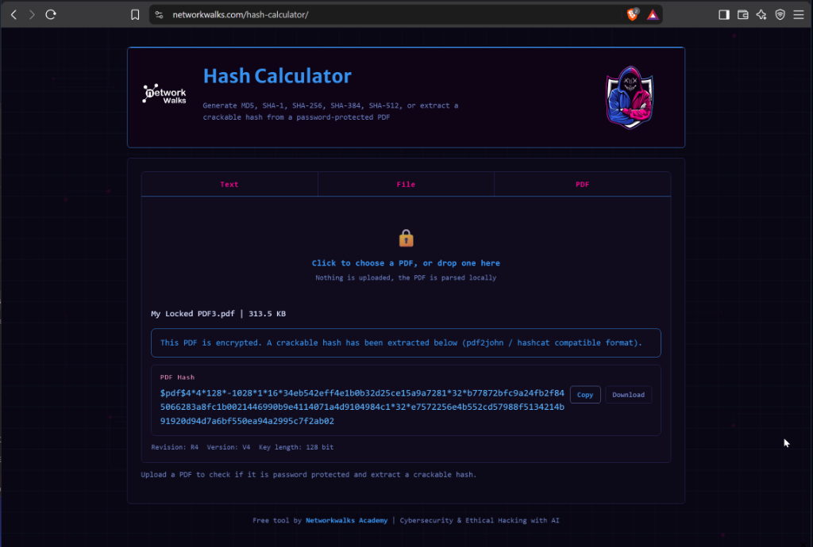
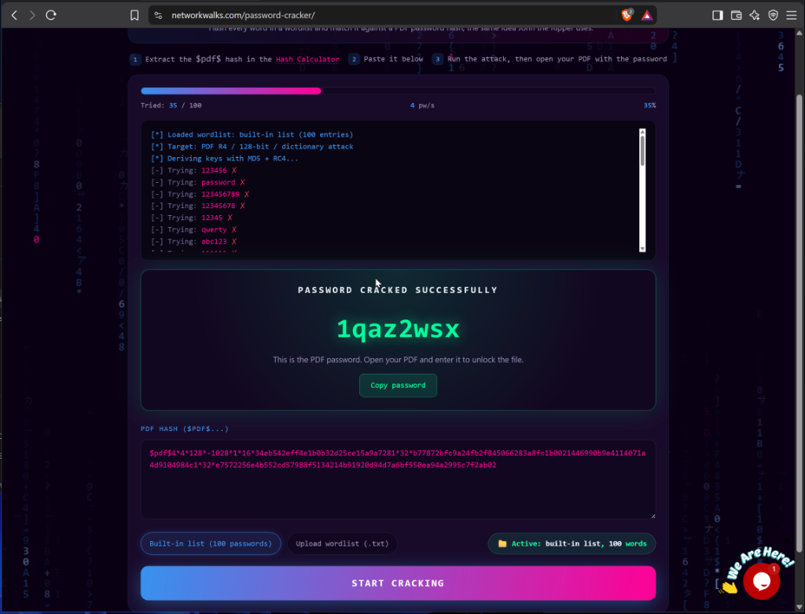
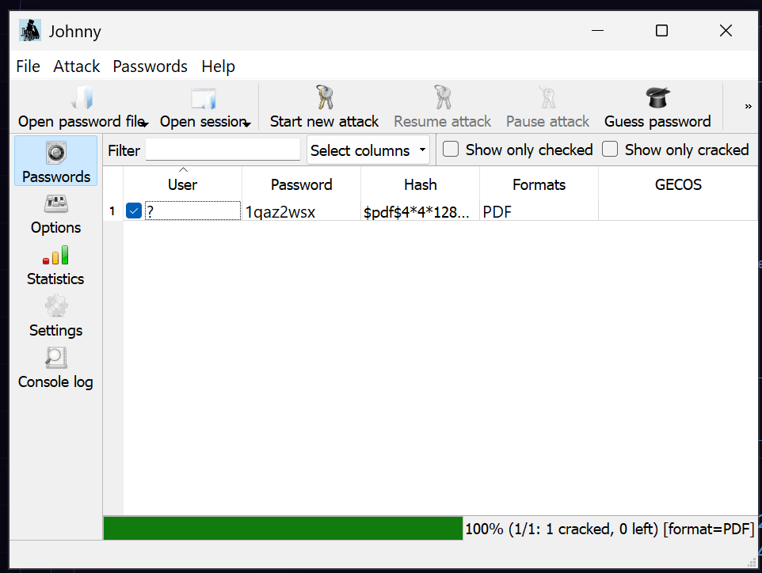
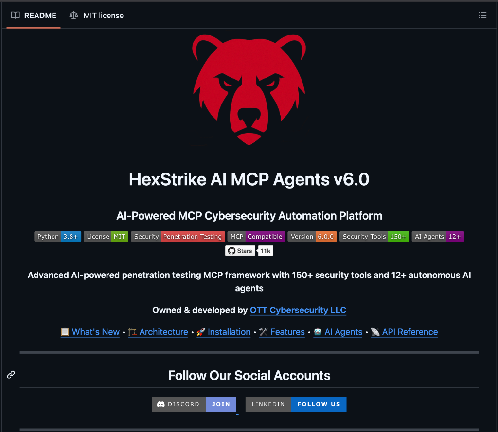
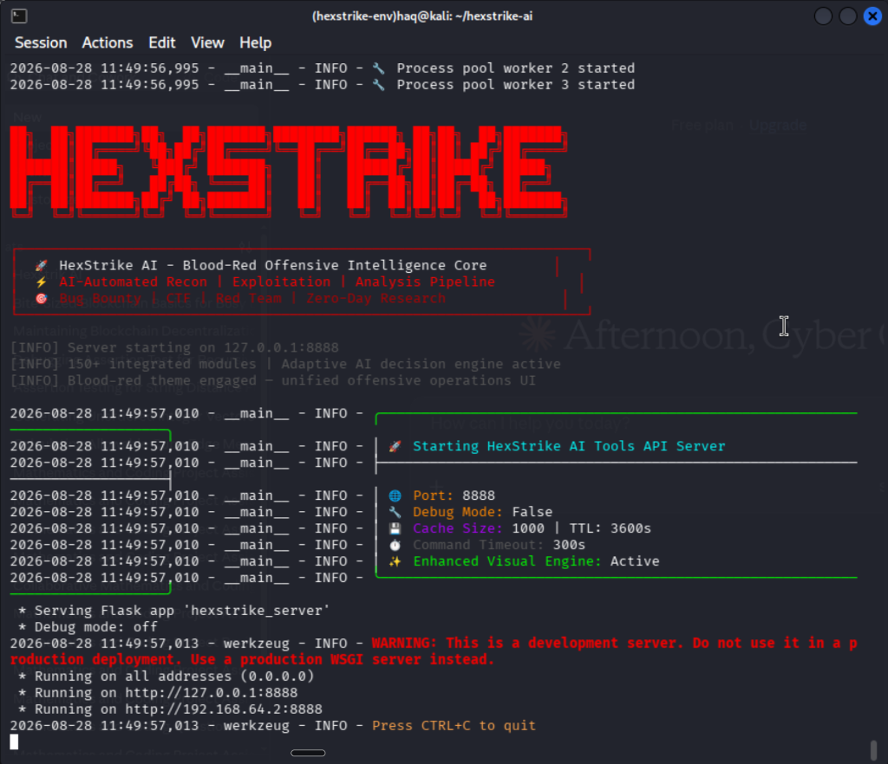
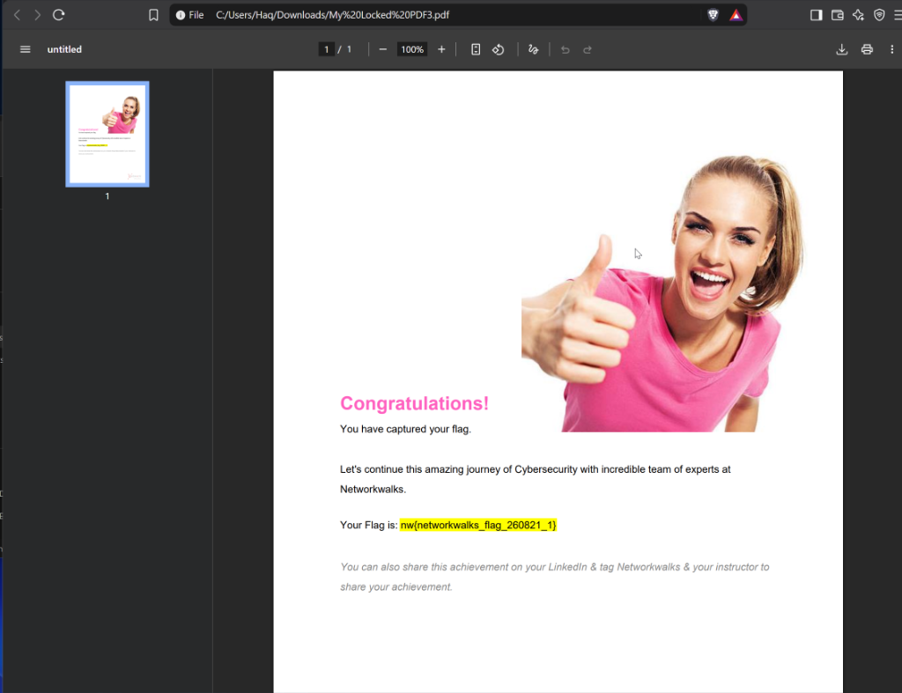
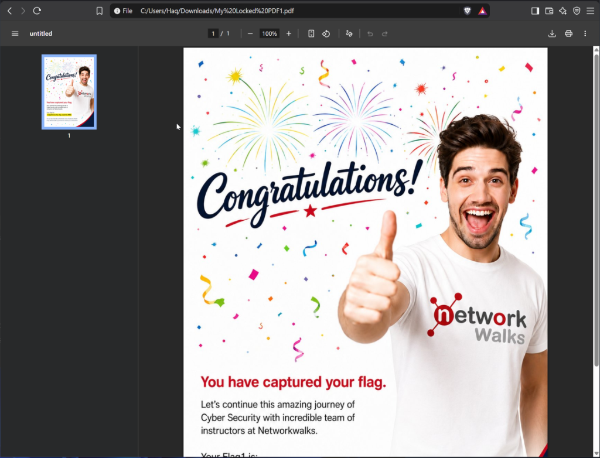

# CREDENTIAL RECOVERY & AI-ASSISTED AUDITING
### `CYBERSECURITY | NETWORKWALKS`

---

| Field | Details |
| :--- | :--- |
| **Topic** | Password Cracking & AI Security Auditing |
| **Program / Batch** | B082-Networkwalks |
| **Date** | August 2026 |
| **Tools Used** | Johnny (John the Ripper GUI), NetworkWalks Online Tools, HexStrike AI v6.0, Claude Desktop MCP |
| **Target** | Password-Protected Lab PDFs (`My Locked PDF3.pdf`, `My Locked PDF1.pdf`) |
| **Recovered Password** | `1qaz2wsx` |
| **Outcome** | Flag captured & verified (`nw{networkwalks_flag_******}`) |

---

## 1. Overview & Objective

In this lab, I was tasked with auditing and cracking password-protected documents provided in the NetworkWalks cybersecurity training environment. 

The goal was to:
1. Extract the encryption hash from a locked PDF file.
2. Crack the hash using both local offline tools (**Johnny / John the Ripper**) and online tools (**NetworkWalks Password Cracker**).
3. Use **HexStrike AI v6.0** connected to **Claude Desktop via MCP** to analyze why the password was vulnerable.
4. Unlock the document and retrieve the hidden flag.

---

## 2. Tools Used

| Tool | Purpose |
| :--- | :--- |
| **NetworkWalks Hash Calculator** | Web tool to parse encrypted PDFs client-side and extract the `$pdf$` hash. |
| **NetworkWalks Password Cracker** | Online tool to run quick dictionary attacks against the extracted hash. |
| **Johnny (John the Ripper GUI)** | Desktop GUI for John the Ripper to crack the hash offline. |
| **HexStrike AI MCP v6.0** | AI offensive security platform running on Kali Linux (`port 8888`). |
| **Claude Desktop (MCP)** | AI interface used with HexStrike to assess password entropy and patterns. |

---

## 3. Step-by-Step Execution

### Step 1: Extracting the Hash from the Protected PDF
To crack a password-protected PDF without stressing system resources, you first need its cryptographic hash:
* Uploaded `My Locked PDF3.pdf` into the **NetworkWalks Hash Calculator**.
* The tool parsed the file locally in the browser and extracted the 128-bit `$pdf$` hash string:
  ```text
  $pdf$4*4*128*-1028*1*16*34eb...[REDACTED]...e7572256e4b552cd57988f5134214b91920d94d7a6bf550ea94a2995c7f2ab02
  ```

---

### Step 2: Cracking the Hash
I tested cracking the hash using two methods:

1. **Online Method (NetworkWalks Password Cracker)**:
   * Pasted the extracted `$pdf$` hash into the online cracker.
   * Ran a dictionary attack using the built-in list.
   * Successfully cracked the password in **35 attempts**: **`1qaz2wsx`**.

2. **Offline Method (Johnny / John the Ripper GUI)**:
   * Opened **Johnny** on the workstation and loaded the hash.
   * Johnny automatically detected the format as `[format=PDF]`.
   * Started the attack and successfully recovered the same password: **`1qaz2wsx`** (100% cracked).

---

### Step 3: AI-Assisted Security Analysis (HexStrike AI & Claude MCP)
To understand why this password was cracked so easily, I used **HexStrike AI v6.0** connected to **Claude Desktop via MCP**:
* Started the HexStrike AI API server in Kali Linux on `http://127.0.0.1:8888`.
* Connected Claude Desktop via Model Context Protocol.
* **Analysis**: Although `1qaz2wsx` is 8 characters long and contains numbers and letters, it is a simple **keyboard walk** (the first two columns of a standard QWERTY keyboard: `1-q-a-z` and `2-w-s-x`). Because standard wordlists prioritize keyboard walks, it was cracked almost instantly.

---

### Step 4: Unlocking the Files & Capturing the Flag
Using the recovered password (`1qaz2wsx`):
* Unlocked `My Locked PDF3.pdf` in the browser and captured the flag: **`nw{networkwalks_flag_******}`**.
* Tested `My Locked PDF1.pdf` with the same password and confirmed successful access, demonstrating the risk of **password reuse across documents**.

---

## 4. Key Findings & Security Risks

* **Keyboard Walk Vulnerability**: Passwords based on spatial keyboard patterns (`1qaz2wsx`, `qwertz`) bypass simple complexity rules but are easily cracked by modern dictionary attacks.
* **Legacy PDF Encryption**: The documents used 128-bit RC4 (Revision 4), which lacks memory-hard key derivation and is fast to brute-force.
* **Credential Reuse**: Using the same password across multiple PDF files allowed both documents to be opened once a single password was compromised.

---

## 5. Remediation Recommendations

1. **Use Modern Encryption**: Protect sensitive PDFs using **AES-256 (PDF Revision 6)** with PBKDF2/SHA-256.
2. **Adopt Passphrases**: Use long passphrases (15+ characters / 4 random words) instead of short 8-character passwords.
3. **Avoid Keyboard Patterns**: Use password managers to generate truly random passwords rather than keyboard patterns.
4. **Never Reuse Passwords**: Assign unique passwords to different documents and systems.

---

## 6. Evidences Collected

### 6.1 PDF Hash Extraction (NetworkWalks Hash Calculator)
*Extracting the `$pdf$` hash from `My Locked PDF3.pdf` using the NetworkWalks Hash Calculator.*  


---

### 6.2 Online Password Cracking (NetworkWalks Password Cracker)
*Recovering the password `1qaz2wsx` via the NetworkWalks online cracker.*  


---

### 6.3 Offline Password Cracking (Johnny / John the Ripper)
*Johnny GUI showing 100% completion and the cracked password `1qaz2wsx`.*  


---

### 6.4 HexStrike AI & Claude MCP Integration

#### HexStrike AI Framework Overview (v6.0)
*HexStrike AI platform overview with 150+ security tools and MCP agent support.*  


#### HexStrike AI API Server Running on Kali Linux
*HexStrike AI API server active on port 8888.*  


---

### 6.5 Unlocked Documents & Flag Verification

#### Flag Captured from `My Locked PDF3.pdf`
*Opening `My Locked PDF3.pdf` with `1qaz2wsx` and verifying the captured flag.*  


#### Flag Verification on `My Locked PDF1.pdf`
*Verifying access and credential reuse on `My Locked PDF1.pdf`.*  


---

## -End-

👤 **Author**: Cybersecurity Professional  
📌 **Batch**: B082-Networkwalks  
🔗 **Repository**: [Password-Cracking-W-Claude-MCP-AI-Internship-Week3](https://github.com/dr-winner/Password-Cracking-W-Claude-MCP-AI-Internship-Week3)
